# DevGraph — Graph Database Explorer

> An interactive graph database application built with **React, Node.js, Express, TypeScript, and CognoDB** for the Wexa AI take-home assignment.

**Live Demo:** https://devgraph-pi.vercel.app

---

## 1. Overview

DevGraph is an interactive application for exploring relationships between **developers, projects, companies, and technologies**.

The application is designed around a graph-first workflow rather than treating each entity as an isolated record.

It provides two main experiences:

### Explore Network

Search for an entity and open its graph.

From there, users can:

- Inspect the selected entity.
- View its immediate relationships.
- Explore connected entities one hop at a time.
- Continue expanding the graph without replacing the existing exploration.

### Find Connection

Select two entities and discover their shortest connection.

The resulting path is:

- Rendered directly in the graph.
- Highlighted visually.
- Presented as a connection summary.
- Available for further inspection through the graph UI.

---

# 1.1. Screenshots

> Find images related to application here.

## 1.1 Discovery / Home

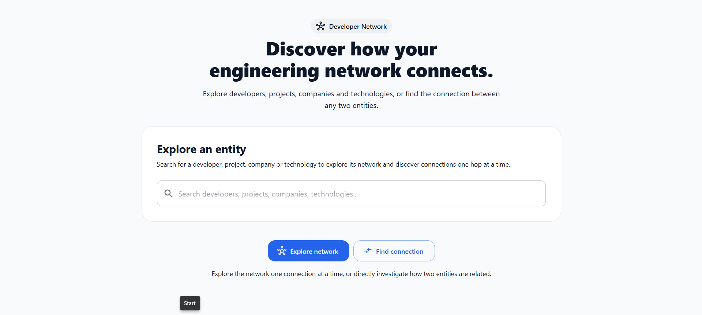
<b>Discovery / Home</b>

<table>
  <tr>
    <td align="center">
      <br/>
      <b>Explore Network Page</b>
    </td>
    <td align="center">
      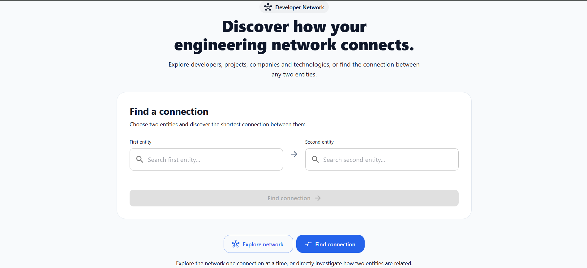<br/>
      <b>Find Connection Page</b>
    </td>
    </tr>
    <tr>
    <td align="center">
      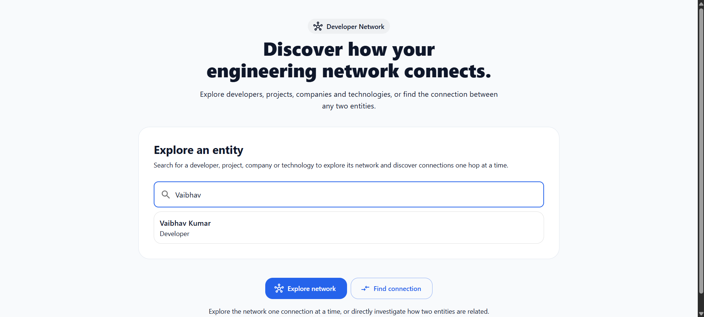<br/>
      <b>Explore Entity</b>
    </td>
    <td align="center">
      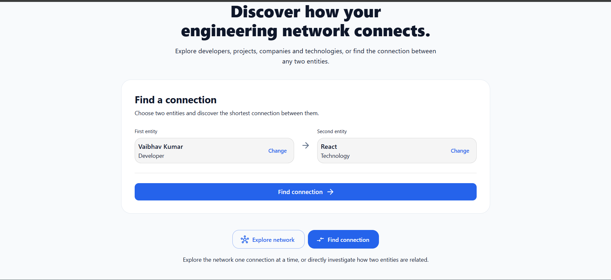<br/>
      <b>Find Connection</b>
    </td>
  </tr>
</table>

screenshot:

- Hero section
- Explore Network mode
- Find Connections
- Search field
- Search results

---

## 1.2 Graph Explorer

<table>
  <tr>
    <td align="center">
      <br/>
      <b>Seach Entity</b>
    </td>
    <td align="center">
      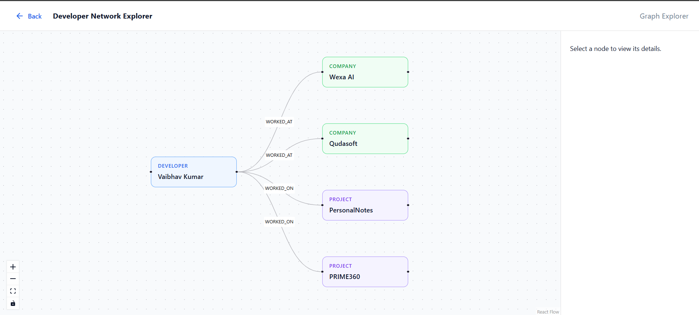<br/>
      <b>Explore Entity</b>
    </td>
  </tr>
  <tr>
    <td align="center">
      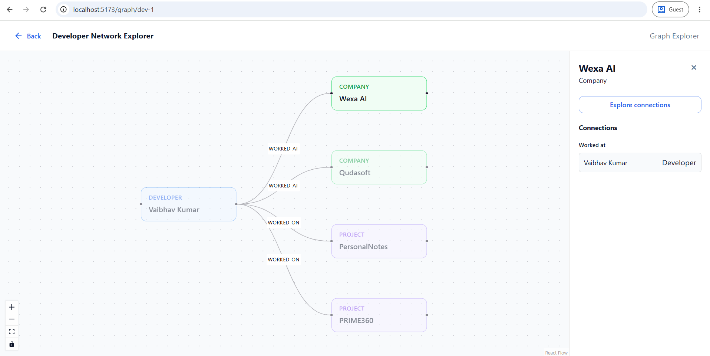<br/>
      <b>select any entity and get details</b>
    </td>
    <td align="center">
      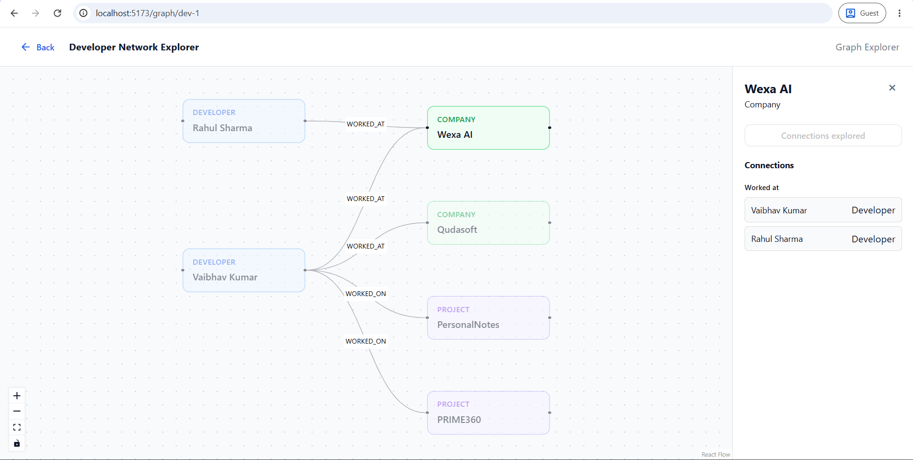<br/>
      <b>selected entity explored</b>
    </td>
  </tr>
</table>

Suggested screenshot:

- Multiple graph nodes
- Relationships
- Selected node
- Node details panel

---

## 1.3 Connection Finder

<table>
  <tr>
    <td align="center">
      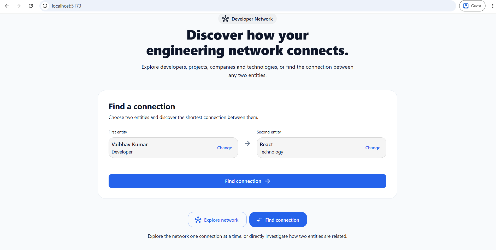<br/>
      <b>Type Two Entities </b>
    </td>
    <td align="center">
      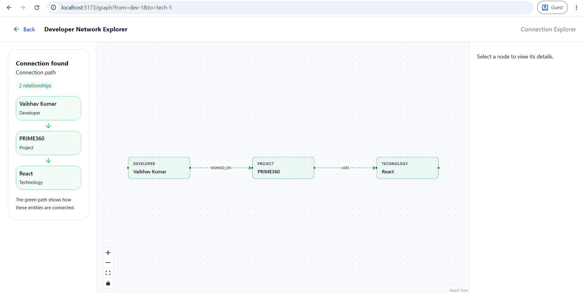<br/>
      <b>Found Connection</b>
    </td>
  </tr>
  <tr>
    <td align="center">
      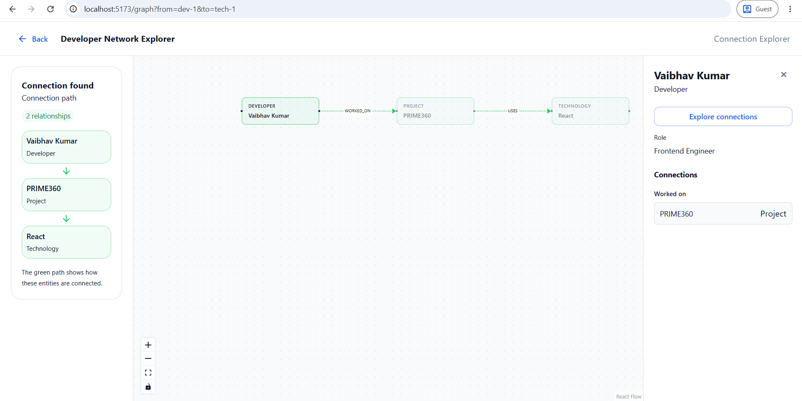<br/>
      <b>select any entity and get details</b>
    </td>
    <td align="center">
      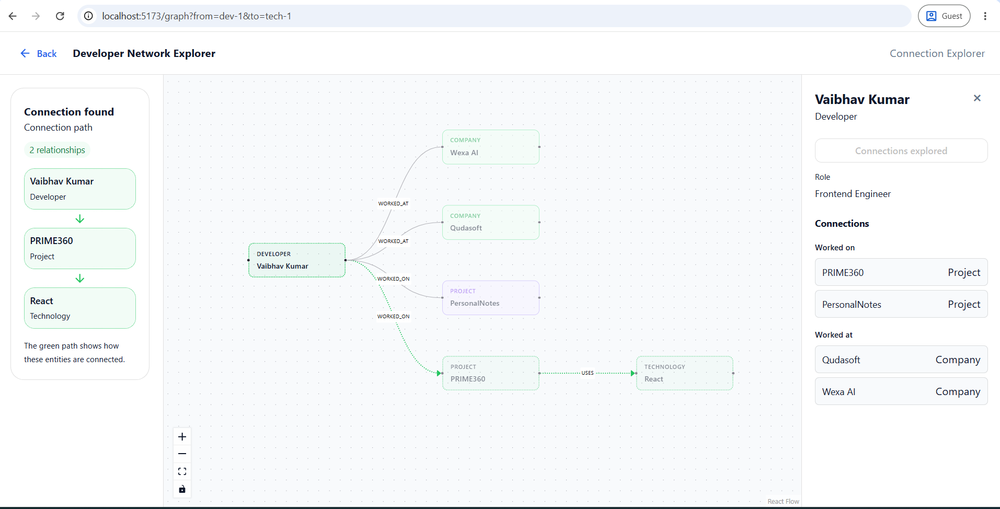<br/>
      <b>selected entity explored</b>
    </td>
  </tr>
</table>

screenshot:

- Two selected entities
- Green highlighted connection path
- Connection Summary sidebar

---

## 2. Why a Graph Database?

The interesting questions in this application are about **relationships and paths**, not simply retrieving individual records.

For example:

- Which projects did a developer work on?
- Which companies are connected to a developer?
- Which technologies are used by a project?
- How are two entities connected?
- What entities can be reached from a selected entity?
- What is the shortest path between two entities?

A relational database can model the same information using tables and foreign keys, but relationship-heavy exploration can require increasingly complex joins as the number of entity types, relationship types, and traversal hops grows.

A graph database represents relationships as first-class data:

```text
Developer ──WORKED_ON──> Project ──USES──> Technology
    │
    └──WORKED_AT──> Company

Technology ──RELATED_TO──> Technology
```

This makes traversal and path discovery natural operations on the data model.

For this application, the graph model is particularly useful because the UI itself is a visualization of the underlying relationships.

---

# 3. Key Features

## Entity Search

Search for entities by name across the graph.

Supported entity types:

- Developer
- Project
- Company
- Technology

The API uses a parameterized Cypher query and returns matching entities ordered by name.

## Interactive Graph Explorer

The graph view provides:

- Interactive nodes and relationships.
- Node selection.
- Node details.
- Relationship information.
- One-hop graph exploration.
- Incremental graph expansion.
- Loading and error states.
- Automatic graph layout using Dagre.

## One-Hop Exploration

Selecting a node allows the user to explore its immediate neighborhood.

The backend retrieves:

```text
Selected Node
    │
    ├── Relationship ──> Connected Node
    ├── Relationship ──> Connected Node
    └── Relationship ──> Connected Node
```

The frontend merges the newly discovered nodes and relationships with the current graph.

This allows the user to progressively explore the graph rather than loading an unnecessarily large graph upfront.

## Connection Finder

The connection workflow allows the user to select two entities and find their shortest connection.

The path returned by the graph database is visualized in the graph and highlighted in green.

A connection summary also displays the entities and relationships that make up the path.

---

# 4. Technology Stack

## Frontend

- React 19
- TypeScript
- Vite
- Material UI
- Redux Toolkit / RTK Query
- React Router
- React Flow
- Dagre

## Backend

- Node.js
- Express
- TypeScript
- Official Neo4j JavaScript Driver
- CORS
- dotenv

## Database

- CognoDB Cloud
- openCypher
- Bolt protocol
- Official Neo4j driver

## Deployment

- Frontend: Vercel
- Backend: Render
- Database: CognoDB Cloud

---

# 5. Architecture

```text
                         ┌──────────────────────┐
                         │       Browser        │
                         │                      │
                         │ React + TypeScript   │
                         │ MUI + React Flow     │
                         └──────────┬───────────┘
                                    │
                                    │ HTTPS / REST
                                    ▼
                         ┌──────────────────────┐
                         │     Express API      │
                         │                      │
                         │ Routes               │
                         │   ↓                  │
                         │ Services             │
                         │   ↓                  │
                         │ Neo4j Driver         │
                         └──────────┬───────────┘
                                    │
                                    │ Bolt
                                    ▼
                         ┌──────────────────────┐
                         │     CognoDB Cloud    │
                         │                      │
                         │     Graph Data       │
                         │      openCypher      │
                         └──────────────────────┘
```

The backend is intentionally layered:

```text
routes
  ↓
services
  ↓
database driver
  ↓
CognoDB
```

The frontend is organized around feature/page boundaries, with graph API access separated from graph visualization components.

---

# 6. Data Model

The current seed data contains four node types.

## Nodes

### Developer

Properties:

```text
id
name
role
```

### Project

Properties:

```text
id
name
description
```

### Company

Properties:

```text
id
name
```

### Technology

Properties:

```text
id
name
category
```

## Relationships

The seed script creates these relationship types:

```text
Developer ──WORKED_ON──> Project

Project ──USES──> Technology

Developer ──WORKED_AT──> Company

Technology ──RELATED_TO──> Technology
```

## Data Model Diagram

```text
                         ┌───────────────┐
                         │   Developer   │
                         │               │
                         │ id            │
                         │ name          │
                         │ role          │
                         └───────┬───────┘
                                 │
                    ┌────────────┴────────────┐
                    │                         │
                WORKED_ON                 WORKED_AT
                    │                         │
                    ▼                         ▼
             ┌───────────────┐        ┌───────────────┐
             │    Project    │        │    Company     │
             │               │        │               │
             │ id            │        │ id            │
             │ name          │        │ name          │
             │ description   │        └───────────────┘
             └───────┬───────┘
                     │
                   USES
                     │
                     ▼
             ┌───────────────┐
             │  Technology   │
             │               │
             │ id            │
             │ name          │
             │ category      │
             └───────┬───────┘
                     │
                 RELATED_TO
                     │
                     ▼
             ┌───────────────┐
             │  Technology   │
             └───────────────┘
```

---

# 7. Seed Data

The repository contains a database seed script:

```text
server/scripts/seed.ts
```

The seed script creates realistic sample data including:

### Developers

- Vaibhav Kumar
- Rahul Sharma
- Priya Singh

### Projects

- PRIME360
- PersonalNotes
- Hiring Platform

### Companies

- Qudasoft
- IncipientInfo
- Solulab
- Wexa AI

### Technologies

- React
- TypeScript
- Node.js
- AWS
- MongoDB

The seed script uses `MERGE` so the sample entities and relationships can be safely created without blindly duplicating existing graph records.

Run:

```bash
npm run seed
```

from the `server` directory.

---

# 8. Main Cypher Queries

All application queries use parameters rather than concatenating user input into Cypher.

## 8.1 Search

The application searches entity names using a parameter:

```cypher
MATCH (n)
WHERE
  n.name IS NOT NULL
  AND toLower(n.name) CONTAINS toLower($query)

RETURN n
ORDER BY n.name
LIMIT 20
```

The important part is `$query`.

User input is passed separately to the Neo4j driver rather than interpolated into the query string.

---

## 8.2 One-Hop Graph Exploration

The graph explorer retrieves a selected node and its immediate relationships:

```cypher
MATCH (center {id: $nodeId})

OPTIONAL MATCH (center)-[r]-(connected)

RETURN
    center,
    r,
    connected,
    startNode(r) AS sourceNode,
    endNode(r) AS targetNode
```

The `$nodeId` parameter identifies the selected node.

The undirected traversal:

```cypher
(center)-[r]-(connected)
```

allows the explorer to show the node's immediate neighborhood regardless of the direction of the stored relationship.

The backend then reconstructs the original relationship direction using:

```cypher
startNode(r)
endNode(r)
```

This is important for rendering directed graph edges correctly in the frontend.

---

## 8.3 Shortest Connection Path

The connection finder uses a bounded shortest-path traversal:

```cypher
MATCH (from {id: $fromId}), (to {id: $toId})

OPTIONAL MATCH path =
    shortestPath((from)-[*..5]-(to))

RETURN path
```

The two entity IDs are parameterized:

```text
$fromId
$toId
```

The traversal is bounded to a maximum of five relationships. This keeps the path query controlled while still demonstrating multi-hop graph traversal.

The returned path is converted into the API representation:

```text
nodes[]
relationships[]
connected
```

and rendered by the frontend.

---

## 8.4 Why the Path Query Demonstrates a Graph-Specific Strength

Consider a question such as:

> How is Developer A connected to Technology B?

The answer may involve multiple intermediate entities:

```text
Developer
   ↓
Project
   ↓
Technology
```

or:

```text
Developer
   ↓
Company
```

or a longer chain through technology relationships.

The application can ask the graph database for the shortest path directly instead of manually constructing a sequence of relational joins for each possible relationship pattern.

---

# 9. API

The backend exposes the following graph endpoints.

## Health

```http
GET /api/v1/health
```

Used to verify API/database availability.

## Search

```http
GET /api/v1/graph/search?q=<query>
```

Returns matching entities.

## Focused Graph

```http
GET /api/v1/graph/:nodeId
```

Returns the selected node and its one-hop neighborhood.

## Find Path

```http
GET /api/v1/graph/path?from=<fromId>&to=<toId>
```

Returns the shortest connection between two entities, if one exists.

## Full Graph

```http
GET /api/v1/graph
```

Returns the complete connected graph available through the API.

---

# 10. Project Structure

```text
devgraph/
│
├── client/
│   ├── public/
│   ├── src/
│   │   ├── app/
│   │   │   ├── store/
│   │   │   └── theme/
│   │   │
│   │   ├── features/
│   │   │   └── graph/
│   │   │       ├── api/
│   │   │       ├── components/
│   │   │       │   ├── GraphCanvas/
│   │   │       │   ├── GraphNode/
│   │   │       │   └── NodeDetails/
│   │   │       └── utils/
│   │   │
│   │   └── pages/
│   │       ├── HomePage/
│   │       │   ├── DiscoveryHero/
│   │       │   ├── DiscoveryModeSwitch/
│   │       │   ├── ExploreMode/
│   │       │   └── ConnectionMode/
│   │       │
│   │       └── GraphPage/
│   │           └── ConnectionSummary/
│   │
│   ├── vercel.json
│   └── package.json
│
└── server/
    ├── scripts/
    │   └── seed.ts
    │
    ├── src/
    │   ├── config/
    │   │   ├── database.ts
    │   │   └── env.ts
    │   │
    │   ├── middleware/
    │   │   └── error.middleware.ts
    │   │
    │   ├── routes/
    │   │   ├── developer.routes.ts
    │   │   ├── graph.routes.ts
    │   │   └── health.routes.ts
    │   │
    │   ├── services/
    │   │   ├── developer.service.ts
    │   │   └── graph.service.ts
    │   │
    │   ├── utils/
    │   │   └── asyncHandle.ts
    │   │
    │   └── server.ts
    │
    └── package.json
```

---

# 11. Local Setup

## Prerequisites

Install:

- Node.js
- npm
- A CognoDB Cloud account

---

## 11.1 Create a CognoDB Instance

1. Open the CognoDB Cloud console.
2. Create a free instance.
3. Copy the Bolt connection URI.
4. Save the generated `cognodb` password.
5. Keep the password private.

The application connects through the official Neo4j JavaScript driver.

---

# 12. Environment Variables

Create:

```text
server/.env
```

with:

```env
PORT=5000

COGNODB_URI=bolt+s://<your-instance>.databases.cognodb.cloud
COGNODB_USERNAME=cognodb
COGNODB_PASSWORD=<your-password>
```

Do not commit `.env`.

The backend validates the required environment variables during startup.

---

# 13. Install Dependencies

## Backend

```bash
cd server
npm install
```

## Frontend

Open another terminal:

```bash
cd client
npm install
```

---

# 14. Seed the Database

From `server`:

```bash
npm run seed
```

Expected output:

```text
✅ Seed completed successfully
```

---

# 15. Start the Backend

From `server`:

```bash
npm run dev
```

The API will run on:

```text
http://localhost:5000
```

---

# 16. Start the Frontend

From `client`:

```bash
npm run dev
```

Vite will provide the local development URL, normally:

```text
http://localhost:5173
```

The frontend API URL can be configured with:

```env
VITE_API_URL=http://localhost:5000/api/v1
```

---

# 17. Production Deployment

The application is split into two independently deployed services.

```text
Vercel
  │
  │ HTTPS
  ▼
Frontend
  │
  │ HTTPS
  ▼
Render
  │
  │ Bolt
  ▼
CognoDB Cloud
```

## Frontend

The Vite frontend is deployed on Vercel.

Production API configuration:

```env
VITE_API_URL=<production-backend-api-url>
```

The repository contains a `client/vercel.json` SPA rewrite so React Router routes such as:

```text
/graph/dev-1
```

continue to work after a browser refresh.

## Backend

The Express backend is deployed on Render.

Production secrets are configured through Render environment variables rather than committed files.

Required variables:

```text
PORT
COGNODB_URI
COGNODB_USERNAME
COGNODB_PASSWORD
```

---

# 18. UI / UX

The application is intentionally divided into two primary discovery modes.

### Explore Network

```text
Search → Select entity → Graph → Inspect → Explore one hop
```

### Find Connection

```text
Select entity A
        ↓
Select entity B
        ↓
Find connection
        ↓
Shortest graph path
        ↓
Highlighted path + summary
```

The UI includes loading and error handling around API/database operations and provides a clear empty state when no matching entities are found.

---

# 19. Screen Recording

The recording demonstrates:

1. Opening the application.
2. Searching for an entity.
3. Opening the graph.
4. Selecting a node.
5. Exploring one-hop relationships.
6. Returning to discovery.
7. Selecting two entities.
8. Finding their connection.
9. Viewing the highlighted path and connection summary.
10. exploring relationships
11. checking Mobile view

Recommended duration: approximately 2–3 minutes.

---

# 20. Engineering Decisions

### Parameterized Cypher

All user-controlled IDs and search input are passed as parameters to the Neo4j driver.

This avoids building Cypher using string concatenation and keeps query construction separate from user data.

### Layered backend

The backend separates:

```text
Routes
  ↓
Services
  ↓
Database Driver
```

Routes handle HTTP concerns while graph/database logic lives in services.

### Focused graph loading

The graph explorer loads a focused one-hop neighborhood instead of requiring the complete graph for every interaction.

This keeps the initial graph manageable and makes incremental exploration possible.

### Bounded path traversal

Connection discovery uses a maximum path length of five relationships:

```cypher
[*..5]
```

This prevents an unrestricted traversal from becoming unnecessarily expensive on a larger graph.

### Graceful API errors

Database/API failures are handled by the backend error middleware and exposed as appropriate HTTP errors to the frontend.

The UI displays an error state instead of silently failing.

---

# 22. Future Improvements

If this application were developed beyond the take-home scope, useful next steps would include:

- More comprehensive graph filtering.
- Pagination for large search result sets.
- Additional relationship types.
- More sophisticated path ranking.
- Graph history / backtracking.
- Persisted exploration sessions.
- Authentication and user-specific graphs.
- Larger and more diverse seed datasets.
- Automated backend and frontend tests.
- Observability and structured production logging.

---

# 23. Demo

**Live Application:**  
https://devgraph-pi.vercel.app

**Screen Recording:**  
[ADD RECORDING URL]

---

## Built for the Wexa AI CognoDB Take-Home Assignment

DevGraph demonstrates graph-oriented data modeling, parameterized Cypher queries, multi-hop traversal, interactive graph visualization, and a production-style frontend/backend separation using CognoDB as the graph database layer.
